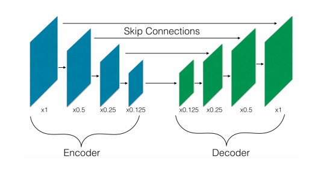
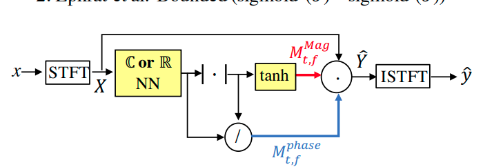
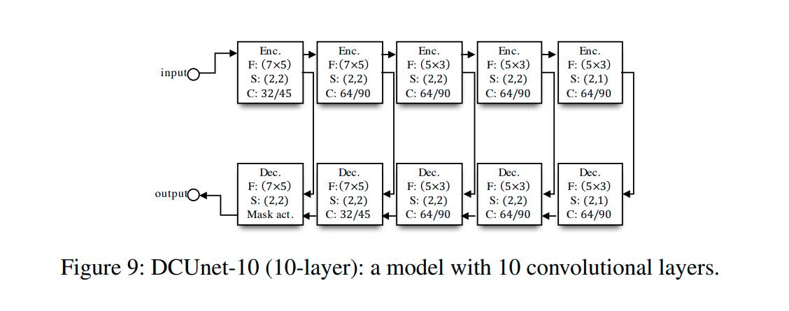

# [Jupyter Notebook](https://github.com/pheepa/DCUnet/blob/master/dcunet.ipynb) #

# Phase-aware speech enhancement with Deep Complex U-Net #
For research I chose this article ["Phase-aware speech enchancement with Deep Complex U-Net"](https://openreview.net/pdf?id=SkeRTsAcYm), which describes the architecture and training of a convolutional neural network for improving speech, so-called denoising, and set up an experiment. 

## The task ##
The main task is to develop a complex variation of the architecture of the well known UNet network to eliminate unwanted noise from the audio.

## Method's features ##
Its speciality and difference from other networks, such as SegNet, for semantic segmentation (not only that) lies in Skip-Connections and that the values of both input data and all of network parameters (convolution filters, etc.) are complex.

### Skip-Connections ###
The main idea is that the early layers of the Encoder are concatenated with the " parallel " layers of the Decoder.

### Mask ###
As a result of the convolution layers, we get a mask, which we multiply by the input time-frequency signal with noise and get a cleared time-frequency signal, which then passes the inverse Short-time Fourier transform.
 

### Alternative solution ###
* [Improved Speech Enhancement with the Wave-U-Net](https://arxiv.org/abs/1811.11307)

## The Experiment ##
For training we will use [Noisy speech database for training speech enhancement algorithms and TTS models](https://datashare.is.ed.ac.uk/handle/10283/2791), which contains a data set for training and testing with 28 and 56 speakers in .wav audio files are 48 KHz. The 10-layer network architecture will be implemented, which looks like this:

A graph of changes in the value of the loss function during training and validation will be shown. 

The PESQ metric will also be calculated.

### Issues ###
Due to my lack of equipment with proper GPU (a laptop with 2 GB of GPU, so the model does not fit into the given memory, not to mention training) I had to consider alternatives for training:

* Training on Google Colab or another cloud service. 
Cloud services have strict session time limits, so it was decided to train on a small number of epochs. 
